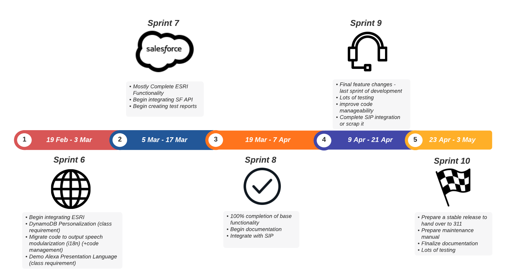
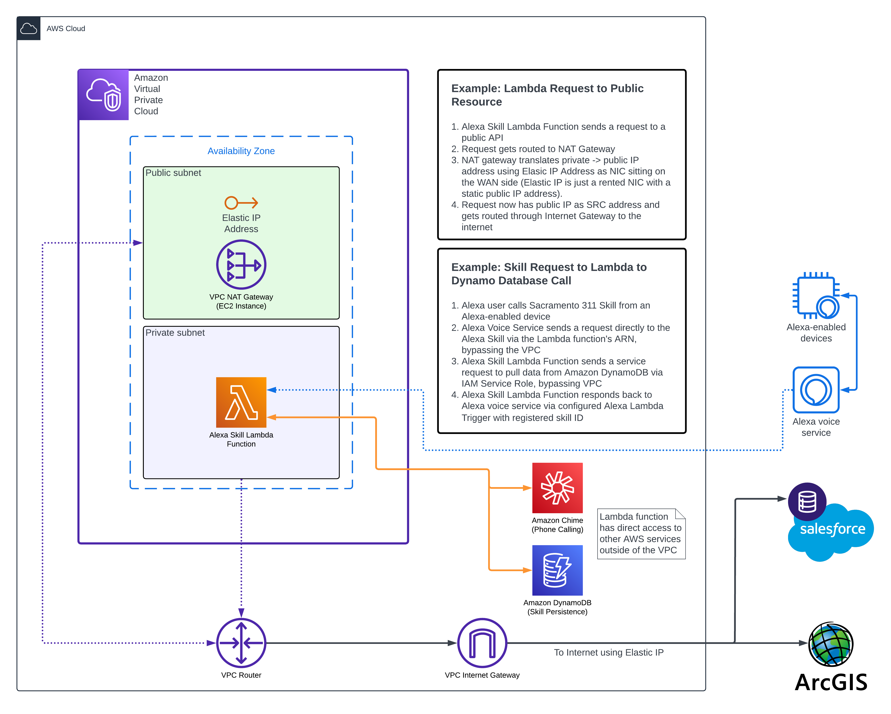
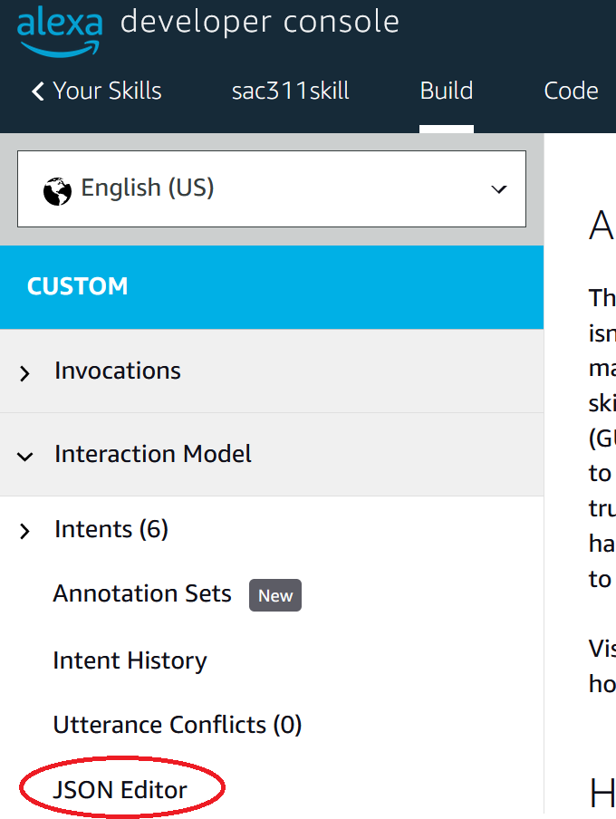
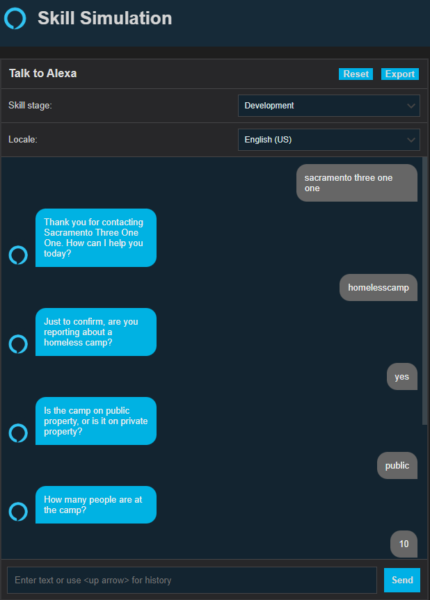

# Alexa, open Sacramento 311 
<figure>

	<figcaption align="left"><b>A project by team Dinosaur Game, CSU Sacramento</b></figcaption>
</figure>

  

  

## **Jump to Section**
* [Synopsis](#Synopsis)
* [Project Overview](#Project-Overview)
* [Main Features](#Main-Features)
* [Timeline](#Timeline)
* [Deployment](#Deployment)
* [Developer Instructions](#Developer-Instructions)
* [Testing](#Testing)

  

  

## **Synopsis**

Sacramento City 311 is a call center with the intent of making life easier for its residents and businesses. The call center receives over 24,000 calls a month on average, and has live representatives working 24 hours a day, 7 days a week. The city wants to provide the best possible experience for callers. 

While the amount of calls have increased, the city has implemented a few solutions to keep wait times minimal, including increasing the number of customer service agents, and making use of Google IVR(a call center AI). 

Google IVR was a huge success, being able to handle the equivalent work load of several full-time customer service agents, but the average wait time for a live agent is still 5-6 minutes, and can be as long as 15 minutes. The city is looking for a solution to decrease these wait times and create a better experience for users.

 That solution is an Alexa Skills extension, that would allow users to report an issue through their Alexa device and create a ticket in the 311 database without the need to speak with a live agent.

  

  

## **Project Overview**
The Sacramento 311 Alexa Skill makes use of the Alexa Skills Kit SDK for Node.js to create a voice user interaction capable of handling a multitude of requests. Once enabled, users may submit service requests or hear about city-related information from the 311 knowledgebase. The Sacramento 311 Alexa Skill integrates with the the City's Esri system for determining serviceability and personalizing the user experience. It also communicates with the city's service request ticketing system for submitting and retrieving tickets. If the Skill cannot handle the request, the user can optionally be routed to a live agent at the Sacramento 311 Call Center. The Skill also uses Alexa Presentation Language to provide visual feedback and, optionally, receive tactile input from users who are using devices with displays.

  

  

## **Main Features**
* Custom Interaction Model
* Handles various use cases including:
  * Service requests
  * Getting the status of a service request
  * Getting information from 311 knowledgebase
* Integrates with GIS and SalesForce CRM
  * Communicates with 311 Esri system
  * Submit and retrieve case/ticket data
  * Route to live agent VoIP to PSTN/SIP
* Uses Amazon service client to retrieve Amazon user information
* Alexa Presentation Language for multimodal user interaction on compatible Alexa-enabled devices
* User-associated persistence with AWS DynamoDB and ASK SDK DynamoDB Persistence Adapter
* Integrates with AWS Chime SIP Media Application for handling and routing Alexa Skill VoIP to PSTN/SIP
* Support for adding dialog models in different languages/dialects

  

  

## **Timeline**

  

### Base Functionality
- [x] Basic use case for an abandoned vehicle service request
	- [x] Identify caller's intent from a wide variety of inputs
	- [x] Verify the caller's intent before collecting details
	- [x] Support collecting service-specific details from the caller throughout the session
- [x] Location retrieval
	- [x] Get geocoordinates from geolocation-enabled devices
	- [x] Get home address from caller's Amazon contact details
	- [x] Get location from caller speech input
	- [x] Verify address with world geocoder and CoS geocoder
- [ ] Contact details retrieval
	- [x] Collect phone number from Amazon user contact details
	- [ ] Confirm phone number with the skill user
	- [ ] Collect a phone number from the skill user
- [ ] Salesforce Integration
	- [x] Make authenticated calls to CoS salesforce CRM via OAuth
	- [ ] Open a generic case (leave a generic description for review)
		- [x] Get case number and caseID back
		- [ ] Confirm all fields are being correctly submitted to SF
	- [ ] Open a non-generic case (abandoned vehicle service request)
		- [x] Get case number and caseID back
		- [ ] Confirm all fields are being correctly submitted to SF
		- [x] Store the case number in DynamoDB for a given skill user
- [x] Working Production-like Environment
	- [x] Connect AWS Lambda function to Alexa Skill
	- [x] Attach a public IP address to Lambda function using AWS VPC (for internal geocoder whitelist)

### Additional Features
- [ ] Get case status information about a previously-submitted case
- [x] Get garbage day
- [ ] Get city information from knowledgebase
- [x] Support for adding new languages

### Future Face

- [ ] Enable [skill personalization](https://developer.amazon.com/en-US/docs/alexa/custom-skills/add-personalization-to-your-skill.html) to identify the speaker based on their voice
	- [ ] Manage data in dynamodb per household user
- [ ]  Send notifications to skill users with the [ProactiveEvents API](https://developer.amazon.com/en-US/docs/alexa/smapi/proactive-events-api.html)
	- [ ] Send a notification when the case status changes
	- [ ] Send a notification from the city
		- [ ] Allow users to unsubscribe from these
- [ ] Enable [account linking](https://developer.amazon.com/en-US/docs/alexa/account-linking/add-account-linking.html) to allow alexa users to sign in to their sacramento 311 account in the skill
- [ ] Integrate Alexa with the Sacramento 311 App using [Alexa for Apps](https://developer.amazon.com/en-US/alexa/alexa-skills-kit/get-deeper/response-api/alexa-for-apps), [Alexa for Apps Documentation](https://developer.amazon.com/en-US/docs/alexa/alexa-for-apps/about-alexa-for-apps.html)
- [ ] [Connect an SIP Media Application](https://docs.aws.amazon.com/chime-sdk/latest/dg/alexa-calling.html) to allow alexa users to be transferred to the 311 call center
- [ ] Add support for spanish speakers using [i18n](https://developer.amazon.com/blogs/alexa/post/285a6778-0ed0-4467-a602-d9893eae34d7/how-to-localize-your-alexa-skills)
- [ ] Create FAQ intents getting answers from the knowledgebase
	- [ ] Call existing dialogflow FAQ bot with AMAZON.searchQuery values, or an FAQ bot wrapper, or using Alexa Conversations
- [ ] Extend the skill by collecting several complex data points using next-gen AI with [Alexa Conversations](https://developer.amazon.com/en-US/docs/alexa/conversations/about-alexa-conversations.html)
- [ ] Create UI for allowing saccity employees to easily manage the interaction model and conversation dialog for the 311 skill 

  

  

## **Deployment**
Deployment instructions for setting up the production environment will include the following:
1. Setting up the Alexa Skill on the Alexa Developer Console
2. Adding our interaction model to the skill
3. Setting up the Lambda function on AWS Console
4. Attaching a public IP to the Lambda Function using AWS VPC
5. Setting the environment variables
6. Using Cloudwatch for troubleshooting logging info

### Production Environment Architecture

  

  

## **Developer Instructions**
1. Go to the [Alexa Developer Console](https://developer.amazon.com/alexa/console/ask) and create and login or create an Amazon Developer account
2. In the Alexa Dev Console, click the "create skill" button
3. Select `Custom` for the model and `Alexa-hosted(Node.js)` for the hosting method
4. For the template, select `Start from Scratch`
5. 
Go to the `build` tab and in the side menu, expand `interaction model`. Select `JSON Editor`, then replace everything with the json from this repo's `./skill-package/interactionModels/en-US.json`.
 

7. Click the `Save Model` button and then click `Build Model`

TODO: Add instructions for local vscode dev setup using ask-sdk-local-debugger using the modified debugger npm package and our launch.json configuration 

8. Run the debugger
9. Go back to the Alexa Developer Console. Go to the test tab and in the text box type type `Open Sacramento Three One One` to invoke the skill and interact with it. Alternatively, you can test the skill on any Alexa enabled device provided you are signed into an associated Alexa developer account on the device.

  

  

##  **Testing**

We constantly test the flow of dialog throughout the iterative development lifecycle of the product.

In addition, the dialog model is tested against Alexa's NLU engine via the Alexa Development Console Utterance Profiler for conflicts and resolutions.

  

  

<figure>

	<figcaption align="left"><b>A project by team Dinosaur Game, CSU Sacramento</b></figcaption>
</figure>
