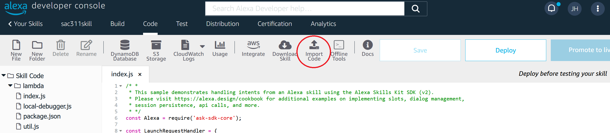
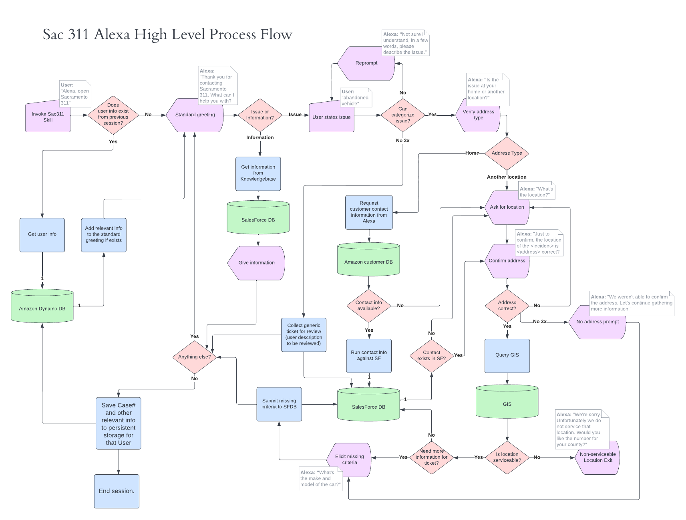
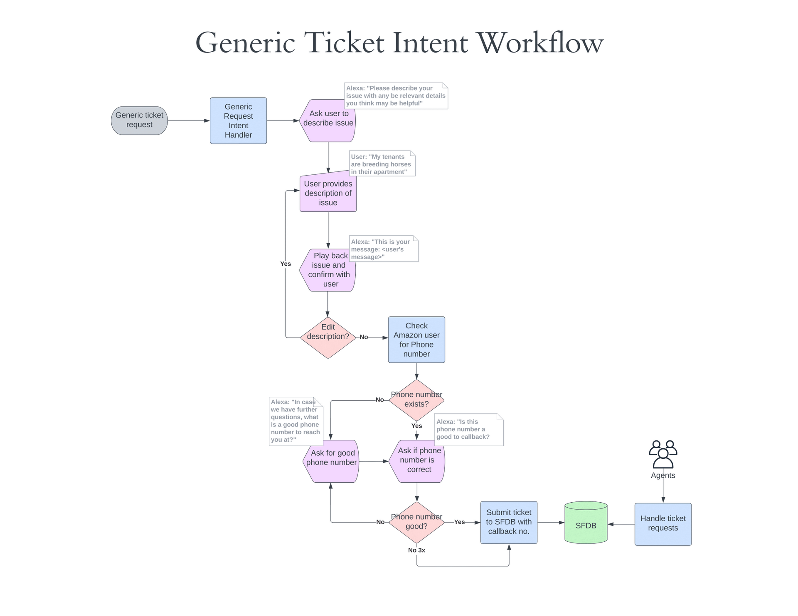
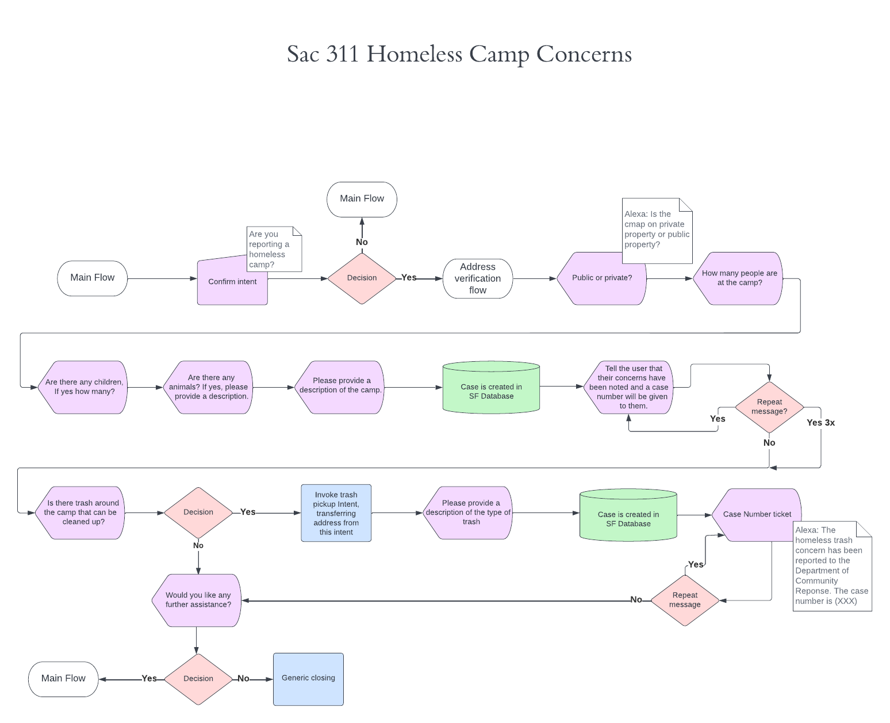
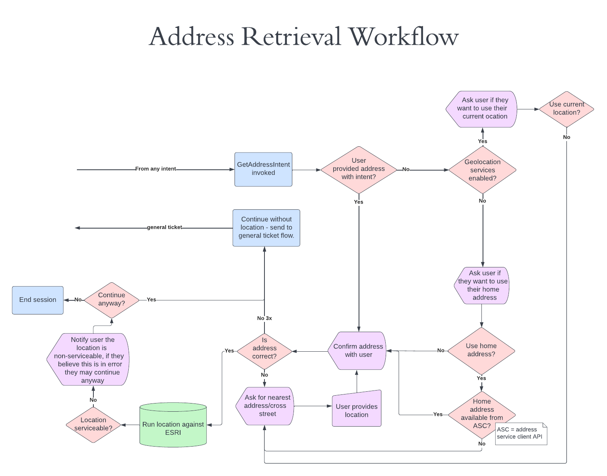

# Alexa, open Sacramento 311 
<figure>

	<figcaption align="left"><b>A project by team Dinosaur Game, CSU Sacramento</b></figcaption>
</figure>

  

  

## **Jump to Section**
* [Synopsis](#Synopsis)
* [Project Overview](#Project-Overview)
* [Install & Documentation](#Install-&-Documentation)
* [Main Features](#Main-Features)
* [Configuration](#Configuration)
* [Testing](#Testing)
* [Deployment](#Deployment)
* [Developer Instructions](#Developer-Instructions)
* [Flow Charts](#Flow-Charts)
* [Timeline](#Timeline)

  

  

## **Synopsis**

Sacramento City 311 is a call center with the intent of making life easier for its residents and businesses. The call center receives over 24,000 calls a month on average, and has live representatives working 24 hours a day, 7 days a week. The city wants to provide the best possible experience for callers. 

While the amount of calls have increased, the city has implemented a few solutions to keep wait times minimal, including increasing the number of customer service agents, and making use of Google IVR(a call center AI). 

Google IVR was a huge success, being able to handle the equivalent work load of several full-time customer service agents, but the average wait time for a live agent is still 5-6 minutes, and can be as long as 15 minutes. The city is looking for a solution to decrease these wait times and create a better experience for users.

 That solution is an Alexa Skills extension, that would allow users to report an issue through their Alexa device and create a ticket in the 311 database without the need to speak with a live agent.

  

  

## **Project Overview**
The Sacramento 311 Alexa Skill makes use of the Alexa Skills Kit SDK for Node.js to create a voice user interaction capable of handling a multitude of requests. Once enabled, users may submit service requests or hear about city-related information from the 311 knowledgebase. The Sacramento 311 Alexa Skill integrates with the the City's Esri system for determining serviceability and personalizing the user experience. It also communicates with the city's service request ticketing system for submitting and retrieving tickets. If the Skill cannot handle the request, the user can optionally be routed to a live agent at the Sacramento 311 Call Center. The Skill also uses Alexa Presentation Language to provide visual feedback and, optionally, receive tactile input from users who are using devices with displays.

  

  

## **Main Features**
* Custom Interaction Model
* Handles various use cases including:
  * Service requests
  * Getting the status of a service request
  * Getting information from 311 knowledgebase
* Integrates with GIS and SalesForce CRM
  * Communicates with 311 Esri system
  * Submit and retrieve case/ticket data
  * Route to live agent VoIP to PSTN/SIP
* Uses Amazon service client to retrieve Amazon user information
* Alexa Presentation Language for multimodal user interaction on compatible Alexa-enabled devices
* User-associated persistence with AWS DynamoDB and ASK SDK DynamoDB Persistence Adapter
* Integrates with AWS Chime SIP Media Application for handling and routing Alexa Skill VoIP to PSTN/SIP
* Account linking - Sign in to City of Sacramento user account via Alexa Skill
* Support for adding dialog models in different languages/dialects

  

  

##  **Testing**
Reserved

Our skill will involve the use of beta testers throughout the iterative development lifecycle of the product. This capability will be possible for future versions following the published product on the Amazon Skill Store.

The dialog model is tested against Alexa's NLU engine via the Alexa Development Console Utterance Profiler for conflicts and resolutions.

  

  

## **Deployment**
Reserved

  

  

## **Developer Instructions**
1. Go to the [Alexa Developer Console](https://developer.amazon.com/alexa/console/ask) and create and login or create an Amazon Developer account
2. In the Alexa Dev Console, click the "create skill" button
3. Select `Custom` for the model and `Alexa-hosted(Node.js)` for the hosting method
4. For the template, select `Start from Scratch`
5. Once the skill has built, go to the `code` tab and import code. Upload a zip of the lambda folder from this repository and then click `Deploy`.

6. 
Go to the `build` tab and in the side menu, expand `interaction model`. Select `JSON Editor`, then replace everything with the json from this repo's `./skill-package/interactionModels/en-US.json`.
 

7. Click the `Save Model` button and then click `Build Model`
8. Wait for the model to finish building then go to the `test` tab and change the dropdown menu from `off` to `Development`.
9. In the text box, type `Open Sacramento Three One One` to invoke the skill and interact with it. Alternatively, you can test the skill on any Alexa enabled device if you are signed in to your developer account.
10. To contribute to the project, working in VSCode with the ASK Toolkit Extension is recommended. For more info on setting that up, follow the documentation [here](https://developer.amazon.com/en-US/docs/alexa/ask-toolkit/get-started-with-the-ask-toolkit-for-visual-studio-code.html)

### Steps for Alexa Skills Toolkit

1. Sign into your Amazon Alexa Account on Alexa Skills Toolkit
2. Click on the drop down menu on the "Skills Management" and select "Download Edit Skill" 
3. Select the default profile and click on the correct Skill, which will then clone the repository to your workspace
4. Run `npm install` in the lambda directory using the terminal

> Optional: Install Ask Dialog run the program on terminal (Might need to change the permissions through powershell)
> 
> `npm install -g ask-cli`

5. Run the debugger and go onto the Alexa Simulator. Set skill stage to "development" and then type or use the alexa voice detection to say "open sacramento three one one." Then alexa will ask you which intent to handle.

Sample utterances to activate the intents:

Homeless Camp: 
> `"There's a homeless camp at J Street"`
> 
> `"Tent on J Street"`

Abandoned Vehicle 
> `"Report an abandoned honda accord at I Street"`
> 
> `"There's a deserted car at I Street"`
> 
> `"Someone ditched their camry in a field"`

  

  

## **Flow Charts**
<!--  -->
### **Sac 311 Alexa High Level Process Workflow**
The high-level workflow diagram gives an overall idea of how the Sacramento 311 skills extension framework works and the process that the user undergoes. 

### **Generic Ticket Request WorkFlow**
The generic ticket intent workflow displays how a user’s ticket issue is processed and the requirements needed for the agents to handle it.

### **Homeless Camp Intent Workflow**
The homeless camp workflow showed the team the user's process and features, providing the team with a better understanding of developing the intent on our Alexa Skills Kit.

### **Address Retrieval Workflow**
The address retrieval workflow shows the framework for retrieving the user’s location, requesting the address, confirming the address, integrating Geolocation services and ESRI, and how the address retrieval will implement to the intents developed.

  

  

## **Timeline**
### **What we've done**
* Custom Dialog Model for Alexa NLU to train on
* Intent handlers for:
	* Reporting abandoned vehicles
	* Reporting homeless encampments
* Slot collection system for filling all required ticket criteria (e.g. make, model, color of vehicle)
	* Persists data between intents throughout the session
* Built a system for handling yes/no questions
* Built a system for collecting user location via device geolocation, Amazon user address, or input from user
* Built a system for collecting any input from the user and storing it as text using AMAZON.SearchQuery slot type
* Integrated with AWS Chime for routing calls from Alexa Skill to any phone number

### **What's left to do**
* Set up DynamoDB and persist data between sessions
* Integrate with 311 Ersi system
* Integrate with 311 SF CRM for ticket submission/retrieval and knowledgebase
* Integrate with 311 SIP CRM for routing calls to live agents
* Create use case for knowledgebase
* Multimodal UI with Alexa Presentaion Language
* Create a few more popular use cases for service requests such as trash pickup. Each use case requires different logic.
* Set up account linking with OAuth for users to sign into their City of Sacramento Account
* Implement Skill Personalization so multiple people using the same Alexa device can be recognized
* Implement internationalization (i18n) for multi-language support in the future.
* Make the software more maintainable and modular by finalizing all abstracted systems designed in Lambda function for future developers to use in new use cases. We won't be able to make all 200 ticket types as each use case requires tailored functionality.